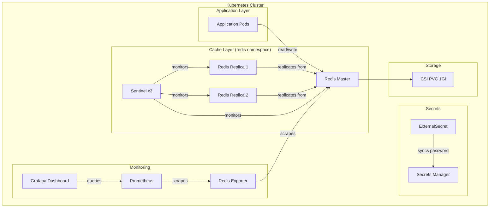
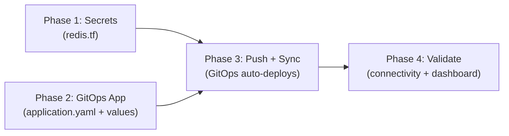

# Add Redis Caching Layer to Kubernetes Cluster

> PRD — Generated by Design Docs Expert | 2026-03-29

## 1. Overview

### Problem Statement
Application response times have degraded as database query volume increased. A caching layer is needed to reduce load on the primary database and improve p95 latency from 800ms to under 200ms.

### Acceptance Criteria

| Criterion | Baseline | Target | Verification |
|-----------|----------|--------|-------------|
| Redis HA deployed via GitOps | No caching layer | 1 master + 2 replicas running | `kubectl get pods -n redis` — all Running |
| Secrets synced via ESO | N/A | ExternalSecret status: SecretSynced | `kubectl get externalsecret -n redis` |
| Cache hit ratio visible in Grafana | No dashboard | Dashboard with hit ratio, memory, latency panels | Open Grafana → search "Redis" dashboard |
| p95 latency for cached endpoints | 800ms | < 200ms | Load test with k6 or curl against cached endpoints |
| Persistent storage | N/A | 1Gi PVC bound to CSI driver | `kubectl get pvc -n redis` — Bound |

### Scope
- **In scope**: Redis deployment, secrets integration, monitoring, Helm values, GitOps Application
- **Out of scope**: Application code changes to use Redis, migration of existing cache from application memory

## 2. Architecture Decision Record

### Context
The cluster runs on constrained resources. Memory is limited. The application currently has no external cache — all caching is in-process and lost on pod restart. Database queries account for 70% of response time on hot paths.

### Decision
Deploy Redis via Bitnami Helm chart as a GitOps-managed Application, using Sentinel mode for automatic failover with 1 master + 2 replicas.

### Alternatives Considered

| Option | Pros | Cons | Verdict |
|--------|------|------|---------|
| Bitnami Redis (Sentinel) | Battle-tested chart, HA, multi-arch support, fits GitOps pattern | Higher memory than standalone | **Chosen** |
| Redis standalone (single pod) | Minimal resources (~64Mi) | No HA, data loss on restart | Rejected — unacceptable for prod |
| Dragonfly | Drop-in Redis replacement, lower memory | Smaller community, less mature Helm chart | Rejected — operational risk |
| KeyDB | Multi-threaded Redis fork | Limited community, compatibility concerns | Rejected — risk too high |

### Consequences
- **Positive**: Sub-200ms cached reads, survives pod restarts, auto-failover via Sentinel
- **Negative**: ~384Mi additional memory usage (128Mi x 3 pods), adds operational complexity
- **Risks**: Memory pressure on worker nodes — monitor via Grafana alerts

## 3. Technical Design

### Architecture Diagram



### Components

| Component | Type | Tool | Module/Chart | Delta |
|-----------|------|------|-------------|-------|
| Redis Application | GitOps Application CRD | Kustomize | `<GITOPS_APPS_PATH>/redis/application.yaml` | Added |
| Redis Helm values | Helm values | Helm | `<GITOPS_APPS_PATH>/redis/values.yaml` | Added |
| Redis ExternalSecret | K8s manifest | Kustomize | `<GITOPS_APPS_PATH>/redis/manifests/external-secret.yaml` | Added |
| Vault/SM secret | Terraform resource | Terraform | `<VAULT_LAYER_PATH>/redis.tf` | Added |
| Kustomization entry | Kustomize base | Kustomize | `<GITOPS_APPS_PATH>/kustomization.yaml` | Modified |
| Grafana dashboard | ConfigMap | Kustomize | `<GITOPS_APPS_PATH>/redis/manifests/dashboard.yaml` | Added |

### Dependencies & Order



Phase 1 and Phase 2 are independent — they can run in parallel. Phase 3 requires both to be committed and pushed. Phase 4 is validation after GitOps syncs.

## 4. Implementation Spec

### Component: Redis (Bitnami Helm chart)

**Configuration:**
- `architecture`: `replication` — HA mode with Sentinel for automatic failover
- `sentinel.enabled`: `true` — enables Sentinel sidecar on each node (3 instances)
- `auth.enabled`: `true`, `auth.existingSecret`: `redis-credentials` — password from ExternalSecret, never in values.yaml
- `master.persistence.size`: `1Gi` — CSI-backed PVC for RDB snapshots
- `master.resources.limits.memory`: `256Mi` — prevents OOM on constrained workers
- `replica.replicaCount`: `2` — minimum for Sentinel quorum with master

**Scenarios:**

#### Scenario: Master pod killed
WHEN the Redis master pod is terminated
THEN Sentinel MUST promote a replica to master within 30s
AND the old master SHOULD rejoin as replica when rescheduled

#### Scenario: All pods killed (node drain)
WHEN all Redis pods are terminated simultaneously
THEN Redis MUST become unavailable until pods are rescheduled
AND data MUST be recovered from PVC (RDB dump) on restart

#### Scenario: ExternalSecret sync fails
WHEN ESO cannot sync the secret from Vault
THEN the Redis pod MUST stay in `Pending` — `existingSecret` not found
AND ESO SHOULD retry sync automatically with backoff

#### Scenario: PVC full
WHEN the 1Gi PVC reaches capacity
THEN Redis MUST stop persisting and return `MISCONF` error on writes
AND the operator SHOULD expand PVC or configure `maxmemory-policy: allkeys-lru`

**Integration Points:**
- Application pods → Redis master (`redis-master.redis.svc:6379`) → Sentinel-aware client recommended
- ExternalSecret → Vault (`workload/redis` → `redis-password` key) → syncs to K8s Secret `redis-credentials`
- Redis Exporter → Prometheus (`ServiceMonitor` in redis namespace) → Grafana dashboard

### Component: Vault Secret (Terraform)

**Configuration:**
- `random_password.redis`: length 32, `special = false` — avoids shell escaping issues in Redis AUTH
- Secret stored at path `workload/redis` with key `redis-password`

**Scenarios:**

#### Scenario: Terraform apply fails
WHEN `terraform apply` fails on the redis.tf resources
THEN the secret MUST NOT be created and ESO MUST NOT be able to sync
AND Redis MUST NOT start until the secret exists — fix the Terraform error and re-apply

#### Scenario: Secret accidentally deleted
WHEN the secret is deleted from the secrets manager
THEN ESO sync MUST fail and Redis MUST lose auth on next pod restart
AND re-running `terraform apply` MUST recreate the secret — ESO auto-retries sync

**Integration Points:**
- Terraform → Vault/secrets manager → ESO → K8s Secret → Redis pod

## 5. Execution Plan

### Phase 1: Secrets

- [ ] **Task 1.1**: Create secret for Redis password in secrets manager
  - Agent: `secrets-config` | Skill: `/terraform`
  - Files: `<VAULT_LAYER_PATH>/redis.tf`
  - Content: `random_password` + secret store resource with key `redis-password`
  - Validation: `terraform plan` — expect 2 new resources

### Phase 2: GitOps Application

- [ ] **Task 2.1**: Create Redis app directory structure
  - Agent: `redis-app` | Skill: `/gitops`
  - Files:
    - `<GITOPS_APPS_PATH>/redis/application.yaml` — Application CRD (multi-source if applicable)
    - `<GITOPS_APPS_PATH>/redis/values.yaml` — Bitnami Redis Helm values
    - `<GITOPS_APPS_PATH>/redis/manifests/external-secret.yaml` — ESO secret sync
  - Validation: `kubectl kustomize <GITOPS_APPS_PATH>/` — must render without errors

- [ ] **Task 2.2**: Register in Kustomize base
  - Agent: `redis-app` | Skill: `/kustomize`
  - Files: `<GITOPS_APPS_PATH>/kustomization.yaml` — add `redis` to resources list
  - Validation: Rendered Application count increases by 1

- [ ] **Task 2.3**: Create Grafana dashboard ConfigMap
  - Agent: `redis-app` | Skill: `/kubernetes`
  - Files: `<GITOPS_APPS_PATH>/redis/manifests/dashboard.yaml`
  - Validation: Valid YAML renders from kustomize

### Phase 3: Deploy

- [ ] **Task 3.1**: Format and commit
  - Agent: `deployer` | Skill: none
  - Commands: Format IaC + git commit with conventional message
  - Validation: `git log --oneline -1` — shows commit

- [ ] **Task 3.2**: Push and verify GitOps sync
  - **REQUIRES USER APPROVAL**
  - Commands: `git push`
  - Validation: Application status is Synced/Healthy

### Phase 4: Validation & Cleanup

- [ ] **Task 4.1**: Verify Redis connectivity
  - Agent: `validator`
  - Commands:
    ```bash
    kubectl get pods -n redis              # all Running
    kubectl get externalsecret -n redis    # SecretSynced
    kubectl exec -n redis <master-pod> -- redis-cli -a $REDIS_PASSWORD ping  # PONG
    kubectl get servicemonitor -n redis    # exists
    ```
  - Validation: PONG response, all pods Running, ExternalSecret synced

- [ ] **Task 4.2**: Run project lint
  - Agent: `lint-all` | Skill: `/audit`
  - Validation: No CRITICAL issues introduced

## 6. Agent Team Definition (large effort only)

### Team Composition

| Agent | Role | subagent_type | Responsibilities |
|-------|------|---------------|-----------------|
| `secrets-config` | Secrets author | `terraform-expert` | Create Terraform resources for Redis password in secrets manager |
| `redis-app` | Application author | `general-purpose` | Create GitOps Application, Helm values, ExternalSecret, dashboard |
| `validator` | Post-deploy validator | `cloud-troubleshooter` | Verify pods, secrets, connectivity, and dashboard |
| `lint-all` | Quality gate | `general-purpose` | Run `/audit` to catch regressions |

### Team Orchestration

```
TeamCreate("sre-redis-cache")

# Phase 1+2 — parallel (independent)
Agent(name="secrets-config", subagent_type="terraform-expert", prompt="<see below>")
Agent(name="redis-app", subagent_type="general-purpose", prompt="<see below>")

# Phase 3 — after Phase 1+2 complete (NEEDS USER APPROVAL)
# Manual: format, commit, push

# Phase 4 — after GitOps sync
Agent(name="validator", subagent_type="cloud-troubleshooter", prompt="<see below>")
Agent(name="lint-all", subagent_type="general-purpose", prompt="/audit")
```

### Agent Prompts

**Agent: secrets-config**
```
You are a Terraform expert configuring secrets for the project at <PROJECT_ROOT>.

CONTEXT:
We are adding a Redis caching layer. Redis needs an auth password stored in the secrets manager and synced to K8s via ExternalSecrets.

YOUR TASK:
1. Read CLAUDE.md for secrets/vault layer conventions
2. Read existing secret resources as a reference pattern
3. Create <VAULT_LAYER_PATH>/redis.tf with:
   - random_password.redis (length 32, special false)
   - Secret store resource at path "workload/redis" with key "redis-password"

VALIDATION:
- terraform fmt -check
- terraform validate (after init)

CONSTRAINTS:
- Follow existing patterns in the vault/secrets layer exactly
- Use sensitive = true on all password resources
- Do not modify any existing files except creating redis.tf
```

**Agent: redis-app**
```
You are a GitOps specialist creating a Kubernetes Application for the project at <PROJECT_ROOT>.

CONTEXT:
We are adding Redis (Bitnami chart, Sentinel mode) as a GitOps-managed Application.

YOUR TASK:
1. Read CLAUDE.md for GitOps and Application CRD conventions
2. Read an existing app directory as template for structure
3. Create <GITOPS_APPS_PATH>/redis/ directory with:

   application.yaml:
   - Bitnami redis chart (latest stable) + git ref for values
   - Namespace: redis (CreateNamespace=true)
   - Auto-sync with prune and self-heal

   values.yaml:
   - Sentinel enabled, 3 replicas
   - Architecture: replication
   - Auth enabled, existingSecret: "redis-credentials", existingSecretPasswordKey: "redis-password"
   - Master persistence: 1Gi (default StorageClass)
   - Resources: master 128Mi/100m request, 256Mi/250m limit
   - Resources: replica 128Mi/100m request, 256Mi/250m limit
   - Metrics exporter enabled (serviceMonitor enabled)

   manifests/external-secret.yaml:
   - ExternalSecret "redis-credentials" in namespace redis
   - Remote ref: key "workload/redis", property "redis-password"

4. Add "redis" entry to <GITOPS_APPS_PATH>/kustomization.yaml resources list

VALIDATION:
- kubectl kustomize <GITOPS_APPS_PATH>/ (must render without errors)
- Verify "redis" appears in kustomization.yaml resources

CONSTRAINTS:
- Follow existing Application CRD patterns exactly
- Use existingSecret pattern for auth (never put passwords in values.yaml)
- Do not create overlay patches unless ignoreDifferences is needed
```

**Agent: validator**
```
You are a K8s troubleshooter validating a Redis deployment at <PROJECT_ROOT>.

CONTEXT:
Redis was just deployed via GitOps. Need to verify everything is healthy.

YOUR TASK:
1. Set KUBECONFIG as defined in CLAUDE.md
2. Check GitOps Application status (Synced + Healthy)
3. Check pods in redis namespace (all Running)
4. Check ExternalSecret (SecretSynced)
5. Check Redis connectivity (redis-cli ping → PONG)
6. Check Sentinel (sentinel masters)
7. Check metrics (servicemonitor exists)

REPORT FORMAT:
- Status: HEALTHY / DEGRADED / FAILED
- For each check: PASS / FAIL with details
- If FAILED: root cause analysis and suggested fix
```

## 7. Dependencies

| Dependency | Type | Status | Impact if Blocked |
|------------|------|--------|-------------------|
| CSI driver installed on cluster | Internal | Available | Phase 2 — Redis can't create PVC for persistence |
| External Secrets Operator deployed | Internal | Available | Phase 2 — ExternalSecret CRD won't work |
| Vault/secrets manager accessible from cluster | Internal | Available | Phase 1 — can't store Redis password |
| ArgoCD running and syncing | Internal | Available | Phase 3 — GitOps deploy won't trigger |
| Prometheus + Grafana stack deployed | Internal | Available | Phase 2 — metrics exporter and dashboard won't work |

## 8. Risks & Mitigations

| Risk | Impact | Probability | Mitigation |
|------|--------|-------------|------------|
| Memory pressure on workers | High — OOM kills other pods | Medium | Set strict resource limits (256Mi max), monitor via Grafana alerts, reduce to 2 replicas if needed |
| CSI storage unavailable | Medium — Redis can't persist | Low | Redis works without persistence (data in memory), CSI should be stable |
| ExternalSecret sync failure | High — Redis starts without auth | Low | Redis pod requires `existingSecret` — won't start without it. ESO retry is automatic |
| Sentinel split-brain | Medium — write conflicts | Low | 3 Sentinel instances prevent split-brain in single-AZ deployments |

## 9. Rollback Plan

```bash
# Option A: Delete via GitOps (clean)
kubectl delete application redis -n <GITOPS_NAMESPACE>
kubectl delete namespace redis

# Option B: Remove from git (permanent)
git rm -r <GITOPS_APPS_PATH>/redis/
# Edit <GITOPS_APPS_PATH>/kustomization.yaml — remove "redis" from resources
git commit -m "revert(cache): remove Redis application"
git push
# GitOps auto-prunes the resources

# Option C: Emergency (if GitOps is broken)
kubectl delete namespace redis --force
kubectl delete application redis -n <GITOPS_NAMESPACE> --force

# Secrets cleanup (optional — safe to leave)
cd <VAULT_LAYER_PATH>
terraform destroy -target=<secret_resource>.redis -target=random_password.redis
rm redis.tf
```

## 10. Approval Checkpoints

- [ ] **Before Phase 1+2**: User confirms Redis architecture (Sentinel vs standalone, resource limits)
- [ ] **Before Phase 3**: User reviews generated files (application.yaml, values.yaml, redis.tf)
- [ ] **Before git push**: User approves commit and push (triggers GitOps sync)
- [ ] **After Phase 4**: User confirms Redis is healthy and dashboard is visible in Grafana

## 11. Decision Log

| Date | Decision | Rationale |
|------|----------|-----------|
| 2026-03-29 | Deploy Redis via Bitnami Helm chart with Sentinel mode | Battle-tested chart, HA support, multi-arch — preferred over standalone (no HA), Dragonfly (immature), KeyDB (compatibility risk) |
| 2026-03-29 | Use ExternalSecrets for password sync instead of sealed-secrets | ESO already deployed in cluster, consistent with existing secret management pattern |
| 2026-03-29 | Single-binary Redis exporter + ServiceMonitor for metrics | Prometheus + Grafana already deployed, exporter is included in Bitnami chart — zero additional setup |
| 2026-03-29 | 1Gi PVC for persistence instead of ephemeral storage | Survives pod restarts, acceptable storage cost, CSI driver already available |
