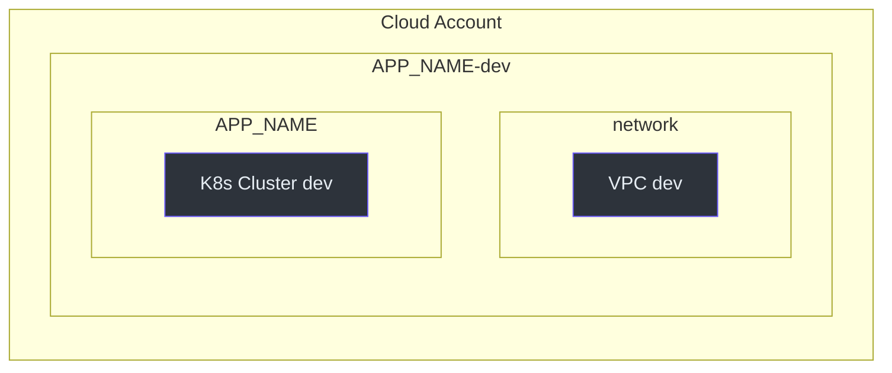
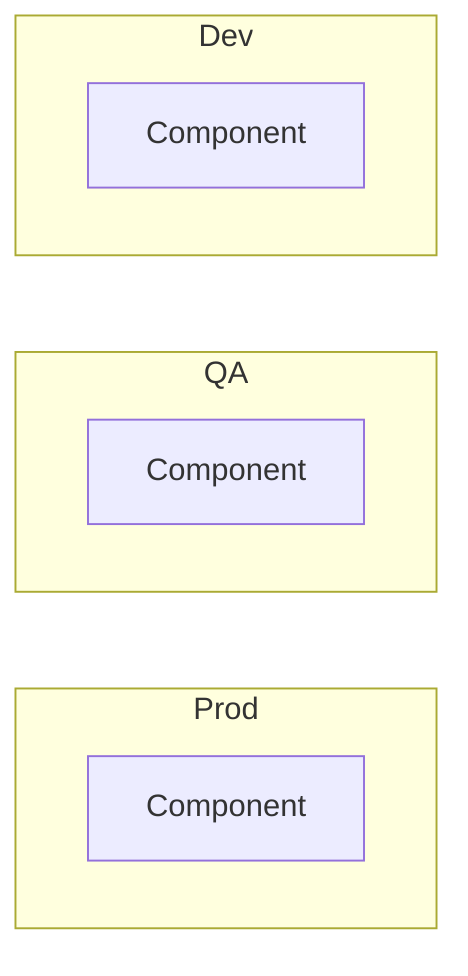
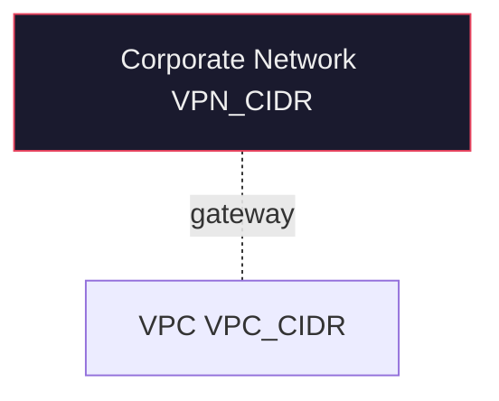
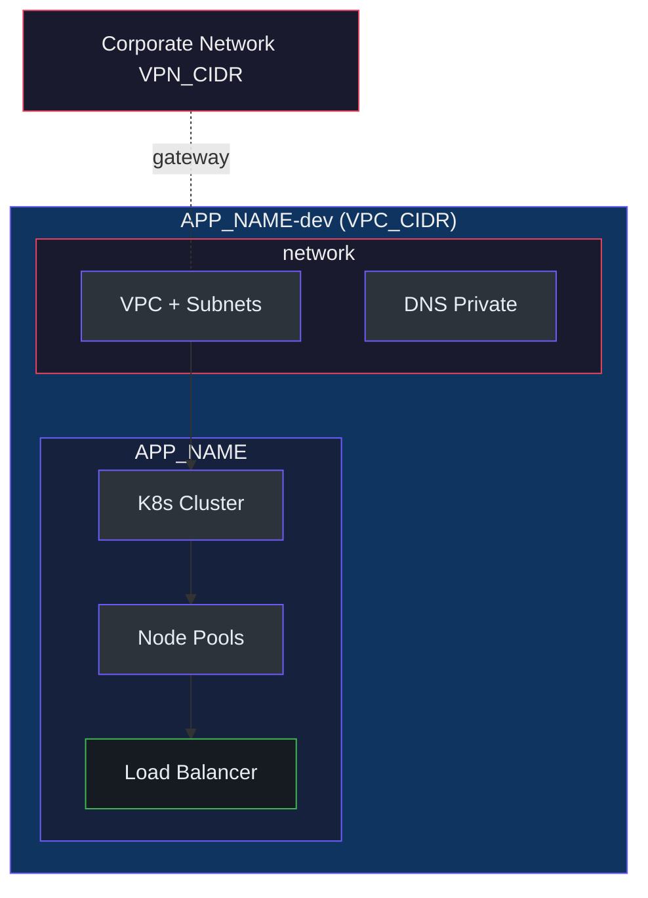
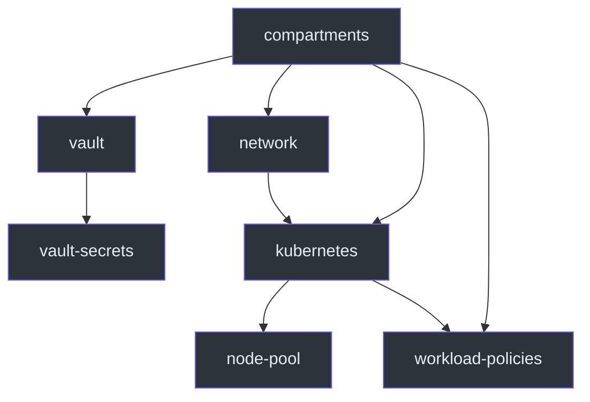

# Mermaid Dark-Mode Style Guide

Complete reference for creating dark-mode compatible Mermaid diagrams for infrastructure documentation.

## Color Palette

### Background / Fill Colors

| Name | Hex | Use For |
|------|-----|---------|
| Deep Navy | `#1a1a2e` | Primary containers, private resources |
| Dark Blue | `#0f3460` | Network resources, VPC/VNet blocks |
| Slate Blue | `#16213e` | Secondary containers, sub-compartments |
| GitHub Dark | `#2d333b` | Cloud resources, general blocks |
| GitHub Darker | `#161b22` | Public resources, load balancers |
| Dark Red | `#4a0e0e` | Critical/destructive resources |
| Dark Green | `#0e4a0e` | Healthy/active status |

### Stroke Colors

| Name | Hex | Use For |
|------|-----|---------|
| Purple | `#6d5dfc` | Cloud services, primary relationships |
| Red | `#e94560` | Private subnets, security groups |
| Green | `#3fb950` | Public subnets, internet-facing |
| Orange | `#d29922` | Warnings, pending resources |
| Cyan | `#58a6ff` | Data flows, DNS |
| Gray | `#8b949e` | Inactive, optional |

### Text Colors

| Name | Hex | Use For |
|------|-----|---------|
| Light | `#e6edf3` | Primary text on dark backgrounds |
| Off-white | `#eee` | Alternative text |

## Standard Class Definitions

Copy-paste this block at the top of every Mermaid diagram:

```mermaid
graph TD
  classDef resource fill:#2d333b,stroke:#6d5dfc,color:#e6edf3
  classDef public fill:#161b22,stroke:#3fb950,color:#e6edf3
  classDef private fill:#1a1a2e,stroke:#e94560,color:#eee
  classDef network fill:#0f3460,stroke:#6d5dfc,color:#eee
  classDef database fill:#16213e,stroke:#d29922,color:#eee
  classDef dns fill:#161b22,stroke:#58a6ff,color:#e6edf3
  classDef vpn fill:#1a1a2e,stroke:#e94560,color:#eee
```

## Subgraph Styles


## Layout Patterns

### Top-Down Overview (graph TD)



### Vertical Chaining with Invisible Edges



### VPN / Private Connectivity (Dashed Lines)



### Complete Environment Template



### Dependency Flow



## Edge Styles

| Style | Syntax | Use For |
|-------|--------|---------|
| Solid arrow | `A --> B` | Direct dependency |
| Dashed arrow | `A -.-> B` | Optional or VPN connection |
| Labeled | `A -->|label| B` | Named relationship |
| Dashed labeled | `A -.-|gateway| B` | VPN via gateway |
| Invisible | `A ~~~ B` | Vertical ordering only |
| Thick | `A ==> B` | Critical path |

## Rules

1. **Always `graph TD`** for overview diagrams (top-down vertical)
2. **Never `graph TB` or `graph LR`** for overview diagrams
3. **Use `~~~`** to chain subgraphs vertically
4. **VPN/connectivity always present** with dashed connections
5. **Dark fills only** -- never use white or light backgrounds
6. **All environments shown** -- never simplify with "same structure"
7. **Consistent class names** across all diagrams in the repo
8. **README.md** uses simplified diagram (no top-level cloud account wrapper)
9. **Deep-dive docs** use complete diagram (with full account/project wrapper)

## Sources

- Mermaid.js Documentation: https://mermaid.js.org/
- GitHub Mermaid Support: https://github.blog/developer-skills/github/include-diagrams-markdown-files-mermaid/
